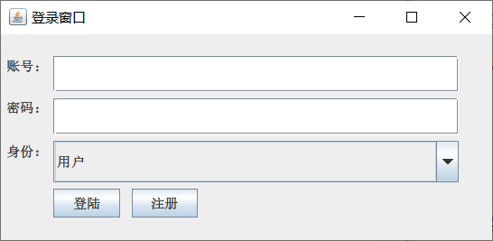
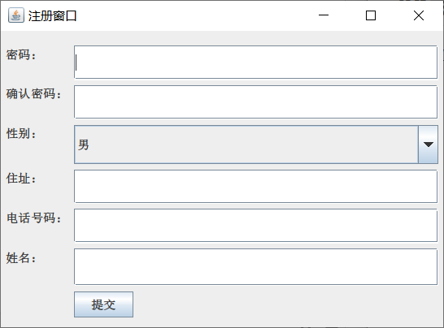
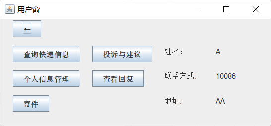
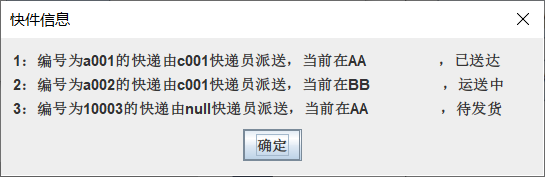
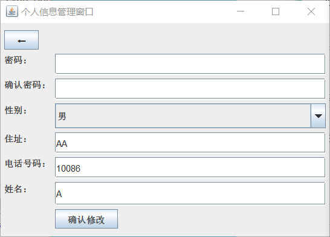
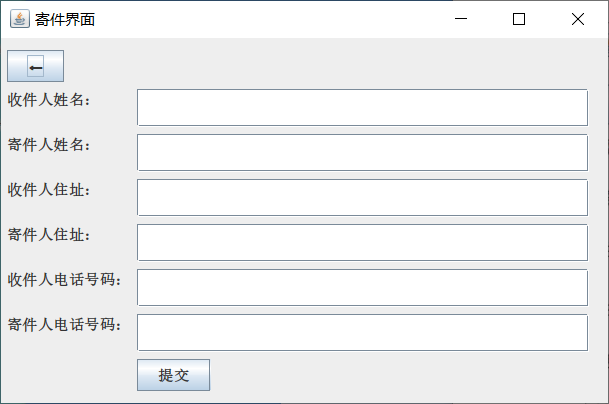
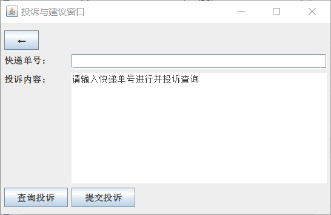
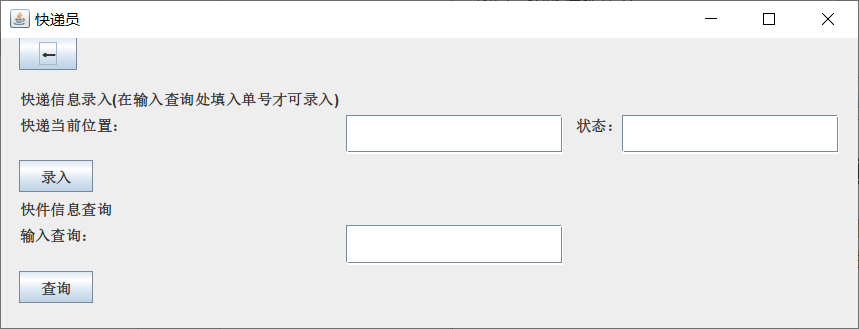

# 快递信息管理系统

> 本系统是某个大三的社会实践周成果，初步目的只是完成老师的要求，后续或许会补充更新，但还请谨慎学习借鉴

根据要求，该系统由以下几个模块组成：

1）角色权限管理模块

系统用户包括收件人（寄件）、快递员、营业厅三种不同角色。其中营业厅系统管理员拥有所有权限，营业厅普通工作人员拥有快递员管理、快件指派、快件信息查询、投诉信息处理等权限，快递员拥有快件信息录入、查询的权限，普通用户拥有寄件（新增快件）、查询快递信息、个人信息管理、投诉与建议的权限。权限的不同等级体现在看到的功能界面不一样，高等级用户看到的界面有更多的超链接和按钮，可以实现更多的功能，例如普通用户不应该看到员工管理、网点管理等信息。

2）登录与注册模块

系统管理员、营业厅普通工作人员、快递员不对外开放注册功能，寄件人可以通过注册后进行登录。

3）员工管理模块

系统管理员通过员工管理模块可以添加、删除、修改以及查询营业厅普通工作人员信息和快递员信息。普通工作人员可以添加、删除、修改快递员信息。

4）网点管理模块

营业厅作为快递公司运输中转站，他们的地位是非常重要的。在系统中系统管理员可以方便地添加、删除、修改以及查询网点的信息。另外，管理员还应该可以查看快件总数、问题件总数进行信息的统计汇总。

5）快件管理模块

主要功能有快件的添加、修改状态、查询。普通用户可以根据快递单号查询、根据收件人/发件人查询。快件状态包括已接收、已审核、待发出、已发出、运输、已签收、退单等状态。在快件的物流过程中始终围绕这几个状态不停地转变。快递员和营业厅工作人员可以修改快件的状态以及快件目前所在位置，普通用户仅可以查询。

6）个人信息管理模块

个人信息模块显示的是当前登录的用户的个人信息，用户可以通过该模块修改个人信息，如电话号码、出生日期、地址等。

7）投诉与建议模块

普通用户对快递员进行问题投诉与建议，系统管理员与网点负责人对用户的投诉可以做出处理与回复。

# 数据库信息
本项目是结合数据库进行的，所以使用的信息都需要与数据库之间进行交互。因此，需要对数据库的结构有一定的了解。

根据`java`文件`GroupLayoutTest.java `中的代码
```java
public static String dbURL = "jdbc:sqlserver:// localhost;DatabaseName=kuaidi;encrypt=true;trustServerCertificate=true";
conn = DriverManager.getConnection(dbURL, "my_user", "user");
```
我们这个项目是使用的本地服务器，建立的数据库名为**kuaidi**，登录名为`my_user`，访问密码为`user`，为了方便进行操作，该用户的权限为管理员权限
## 登录时使用的数据表
登录时，我们需要确认登录人的身份，并根据其身份来确定登录人的信息。故对于每一种身份的人，我们都需要建立一个关系表。因此，在数据库中，我们先设计四个关系表，分别为`用户`；`快递员`；`系统管理员`；`工作人员`；其中每个关系表都拥有两个不能为空的属性，分别为 `id` 和 `pw` 表示用户名和密码，用户名为字符串类型`nchar`，密码为虚拟数值类型`varchar`

- 在关系表**用户**中，通过注册窗口我们可以知道，用户的信息还包括用户名 `username-nchar(10)` 性别 `usersex-nchar(10)` 用户电话 `usertel-varchar(15)` 用户地址 `loc-nchar(50)`

- 关系表 **evaluation** 是用于对于物流服务评价的关系表，这样的关系表需要包含一下五个属性：快件的编号`goodid` 、配送人员的编号`pid` 用户的编号 `uid` 用户对于物流服务的评价 `evaluation` 工作人员对于评价的回复 `respond` 
- 关系表**express_info**（或**expressinformation**）是用于存储快递信息的关系表，包含了一个快递的寄件 `sender/~tel/~loc`、收件人信息 `receiver/~tel/~loc`、快递位置 `expressposition`、快递状态 `expressstatus`、快递编号 `goodid`、快递的配送人 `pid`、与快递绑定的用户 `uid` 等信息


# 窗口、功能模块介绍

## 登录窗口

运行文件`GroupLayoutTest.java` ，我们进入登录界面



在这里面我们通过数据账号和密码进入系统，若没有账号密码也可以通过【注册】按钮点击进行注册

## 注册窗口

在登录窗口点击【注册】即可进入注册窗口，在注册窗口进行注册的默认身份都是用户，因此我们之后会直接将信息加入到用户关系表中



用户的 id 是根据目前数据库中已经有的用户数量来决定的，其生成原理就是读取注册前的用户数量`count` ，将数量+1后前面加 u ,新的用户即为 ‘u(++count)‘ 

## 用户窗口



用户窗口中会发生对于 **寄件** 、**查询物流情况** 、**物流的评价** 、**查看评价回复** 、 **更改个人信息** 这五种行为的操作，我们对应着五种行为都做出了一定的处理。同时，在窗口右侧还能够直接显示一些较为常用的用户信息。

### 查询快递信息

在这一部分，我们选择使用弹窗来进行物流信息的展示，每一条信息代表一个快递的物流情况，其中包含了快递编号、快递配送人员、快递当前位置、快递当前状态。对于这些信息，用户仅有查看权限，没有更改权限。



### 个人信息管理

在这个窗口，用户可以修改个人信息，例如性别、住址、电话号码、用户名等，但不能展示与修改用户的id



### 寄件

用户可以通过这个窗口提交寄件信息，并自行编辑所有的寄件人与收件人相关的信息，提交寄件信息后系统会自动为用户展示快递编号，用户之后也可以通过【查询快递信息】功能进行查看



### 投诉与建议

在该窗口，用户需要先通过输入快递单号查询当前快递是否有投诉信息，通过快递查询确认之后才能进行投诉，在投诉内容编辑好文字之后才能提交投诉。



### 查看回复

对快递进行投诉之后，可以通过【查看回复】查看工作人员对投诉的处理情况


## 快递员窗口

快递员窗口


